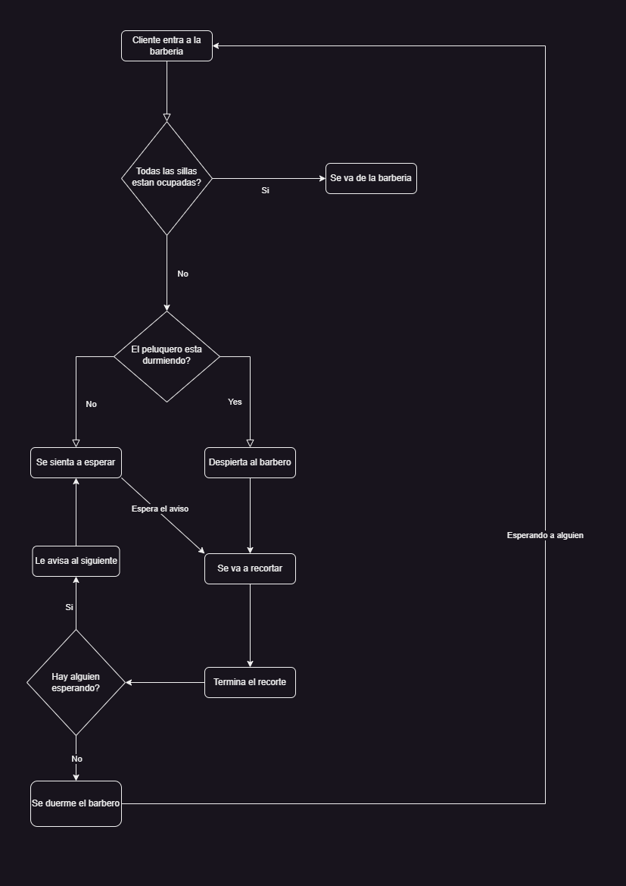

# Problema del barbero dormilon en python

A continucion estaran viendo mi propuesta de solucion al problema del barbero dormilon.

> Problema del barbero.  
> El problema consiste en una barbería en la que trabaja un barbero que tiene un único sillón de barbero y varias sillas para esperar. Cuando no hay clientes, el barbero se sienta en una silla y se duerme. Cuando llega un nuevo cliente, éste o bien despierta al barbero o —si el barbero está afeitando a otro cliente— se sienta en una silla (o se va si todas las sillas están ocupadas por clientes esperando). El problema consiste en realizar la actividad del barbero sin que ocurran condiciones de carrera. La solución implica el uso de semáforos y objetos de exclusión mutua para proteger la sección crítica. 

[diagrama de flujo]:https://drive.google.com/file/d/1AW3Tvg-mTxPTZ1permPVgUkwKOz2ZowT/view?usp=sharing

Como solucion propongo el siguiente [diagrama de flujo].

## Video de explicacion

## Lenguajes del Repositorio

## Creador

Nombre: Joan Corona

Matricula: 2021-0981